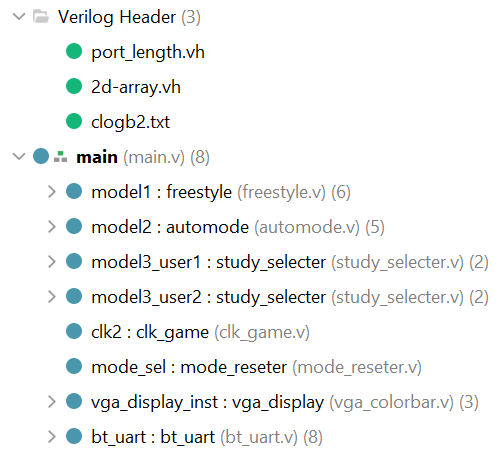
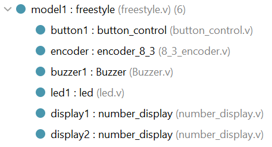
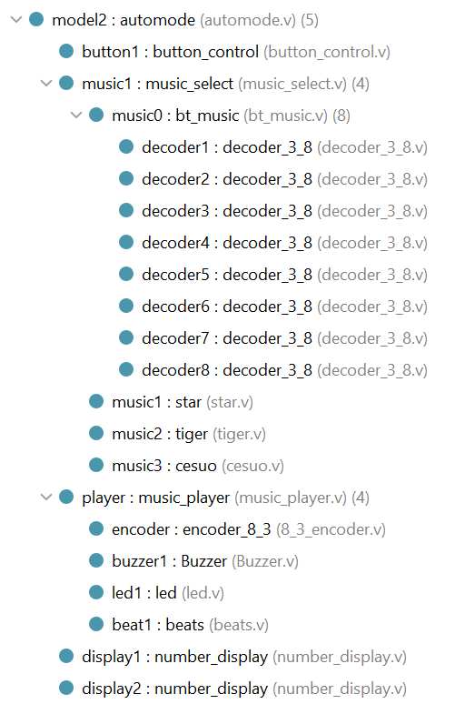
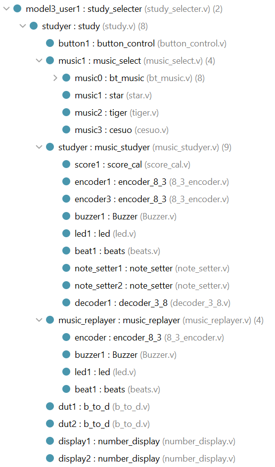
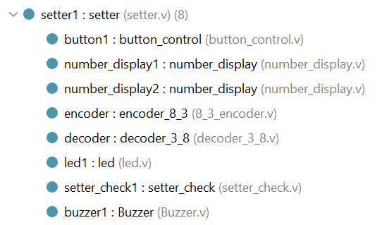
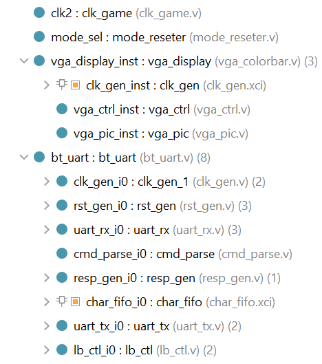

# CS211 数字逻辑（H） 项目设计报告

## Electronic-Piano-Learning-Machine

### Part I. 团队分工及开发日程安排

#### 团队分工

| **姓名**  | **学号**  | **贡献比例**  |
|:-------:|:--------:|:-----:|
| **田源坤** | 12213031 | 33.3% |
| **张天奕** | 12213032 | 33.3% |
| **黎子涵** | 12213030 | 33.3% |

#### 项目开发日程安排

| **日期** | **开发进度**                    |
|:------:|:---------------------------:|
| 第十三周   | 完成自由模式、自动播放模式及其优化           |
| 第十四周   | 完成实时评分、学习模式案件自定义、vga显示的功能   |
| 第十五周   | 完成多用户、学习模式完毕后自动重放、蓝牙传输数据的功能 |
| 第十六周   | 完成录音保存、用户评级更新的功能            |

### Part II. 系统功能列表

1. 自由模式
   - 随意按键，电子琴播放相应的音符
   - 音调调整功能：按下特定按键可以将电子琴音调升高/降低八度
2. 自动演奏模式
   - 学习机自动演奏歌曲
   - 增加音乐库，可以通过特定的按键切换歌曲
   - 在七段数码管并显示当前播放的曲目
   - led灯光指示当前的演奏音符
3. 学习模式
   - 通过不同开关进入不同用户，对应显示用户的评级，并根据每次的演奏记录更新
   - 根据音符顺序和持续时间点亮琴键上方的led灯，以引导用户正确演奏
   - 回放用户演奏数据
   - 实时显示用户的演奏评级
   - 实现自定义按键，可以改变每个按键对应的音符
   - 保存用户演奏记录
4. 其他功能
   - 通过VGA实现图形化的交互
   - 通过蓝牙传入音符，实现自动播放功能

### Part III. 系统使用说明

系统主要交互硬件如图所示

VGA显示界面如图所示

各部分使用说明如下：

1. 模式选择
   - 0号大拨码开关为蓝牙模式开启信号
   - 小八位拨码开关7-0控制系统的模式及用户
     - 仅打开7号，系统进入自由演奏模式
     - 仅打开6号，系统进入自动演奏模式
     - 5、4号拨码开关分别代表两名用户的学习模式
     - 0号拨码开关代表学习模式下的按键设置，打开0号拨码开关与对应用户的拨码开关，即可更改对应用户在学习模式下的按键设置
     - 1号拨码开关代表是否存储当前曲目演奏数据
     - 2号拨码开关代表清空当前用户演奏数据
     - 3号拨码开关表示切换重放演奏数据与学习弹奏

2. VGA显示界面

   - VGA界面中，从左到右七个彩色条纹分别代表do、re、mi、fa、so、la、xi七个音符

3. 自由演奏模式

   - 进入自由演奏模式后，七段数码管左侧会显示free字样，表示当前系统处于自由演奏模式

   - 大八位拨码开关除最右侧一个外从左至右分别为do、re、mi、fa、so、la、xi，最右侧的一个不表示任何音符。
   - 按动五向按钮的左右键可以调整音调高低，音调高低范围为0-3，初始音调默认为1
   - 当拨动大八位拨码开关时，大八位拨码开关上方对应的灯会亮起，VGA显示界面会显示所弹音符对应的彩色条纹。

4. 自动演奏模式

   - 进入自动演奏模式后，七段数码管左侧显示曲目的数字编号，右侧显示当前的播放速度。
   - 按下五向按钮中心键即可开始播放
   - 按下左右键以更换播放曲目
   - 按下上下键以调整歌曲速度，可调整范围为1-9，初始为1
   - 当歌曲播放时，大八位拨码开关上方的led灯会在当前播放的音符对应的拨码开关上亮起，VGA显示屏上对应音符的彩色条纹也会亮起

5. 学习模式

   - 进入学习模式后，七段数码管最左侧三位为当前用户评级，左侧第四位显示曲目的数字编号，右侧显示当前用户的实时得分。
   - 当某一个音符需要被演奏，它对应拨码开关上的led灯会亮起，知道这个音符被演奏了足够的时长才会被熄灭。当用户演奏某一个音符时，VGA显示屏上对应音符的彩色条纹会亮起
   - 若进入回放模式，按确认键自动重放用户演奏数据

6. 设置模式

   - 进入设置模式后，七段数码管左侧显示当前正在绑定的音符名称，VGA显示屏会显示当前正在绑定的音符对应的彩色条纹，do-xi分别为1-7，最右侧显示当前音符被绑定的按键，1-7分别代表左起第1-7个按键
   - 按下确认键，蜂鸣器会播放do音符，拨动希望绑定的拨码开关，按下确认键，该音符会被绑定至该拨码开关，同时系统自动跳转至下一个音符的绑定。也可以通过五向按钮左右键来回到之前的音符或者跳过当前音符
   - 当确认xi音符的绑定关系之后，系统会自动执行检查。若绑定关系中存在一个音符被绑定至两个拨码开关，检查不通过，七段数码管右起第二位显示0，绑定关系初始化。若检查通过，七段数码管右起第二位显示1，绑定关系确认。

### Part IV. 系统结构说明

#### 1. 系统总体结构

#### 2. 系统子模块结构

### Part V. 子模块功能说明

详见 "子模块功能说明.xlsx"

### Part VI. Bonus实现说明

本项目共实现了以下Bonus功能：

- 根据用户喜好调整键位
- 在各模式下使用VGA显示当前弹奏的音符，实现类似钢琴的视觉效果
- 在学习模式下，实时显示用户的演奏评级。创新性的采用了歌曲拍数和用户演奏拍数的比值来评价用户的演奏水平，而不是简单的计算用户演奏的正确率。这样做的好处是，用户可以在演奏过程中随时调整演奏速度，而不会因为演奏速度过快导致评级下降。同时，用户也可以通过调整演奏速度来提高自己的演奏水平。从而达到学习的效果
- 蓝牙模块的使用，实现了通过蓝牙传输音符，实现自动演奏功能，使得本项目更加智能化，更具趣味性

### Part VII. 项目总结

#### 1. 优点

- 本项目实现了一个功能完善的电子琴，具有自由演奏、自动演奏、学习模式等功能，同时还具有VGA显示、蓝牙传输等功能。在实现这些功能的过程中，我们充分发挥了各自的优势，充分利用了各种资源，使得项目的功能得以丰富完善。
- 本项目的代码结构清晰，各个模块之间的耦合度低，易于维护和扩展。同时，我们在项目开发的过程中，充分考虑到了项目的可扩展性，使得项目可以方便地添加新的功能。

#### 2. 缺点

- 本项目在开始初期团队成员未对项目的功能进行充分的讨论，导致在项目开发的过程中，出现了一些功能上的冲突，导致项目的开发进度受到了一定的影响。
- 本项目在开发过程中，由于倾向于使用大量模块，导致项目在修改一些功能时，需要修改的模块较多，增加了项目维护和扩展的难度。

### Part VIII. 出题

#### 坦克大战小游戏

- 使用vga输出游戏画面
- 使用上下左右及中间按键控制坦克移动及发射子弹，击中敌方坦克即可获胜
- led和数码管可以分别用来显示敌方坦克的存往情况和我方坦克的生命值及子弹数量、击杀数量等信息
- 可以使用蓝牙模块实现双人对战
- 可以使用音乐模块实现背景音乐
- 小拨码开关可以用来控制游戏难度和游戏模式
- 大拨码开关可以用来释放技能
